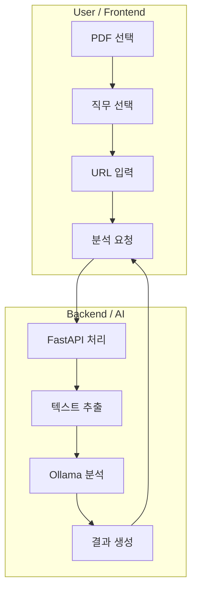

# 자기소개서–채용공고 AI 분석 시스템 Flowchart (상하 분할, 정사각형)

```mermaid
flowchart TD

    %% 상단 : User / Frontend
    subgraph TOP["User / Frontend"]
        direction TB
        A[PDF 선택]
        B[직무 선택]
        C[URL 입력]
        D[분석 요청]
        A --> B --> C --> D
    end

    %% 하단 : Backend / AI
    subgraph BOTTOM["Backend / AI"]
        direction TB
        E[FastAPI 처리]
        F[텍스트 추출]
        G[Ollama 분석]
        H[결과 생성]
        E --> F --> G --> H
    end

    %% 흐름 연결
    D --> E
    H --> D

```
